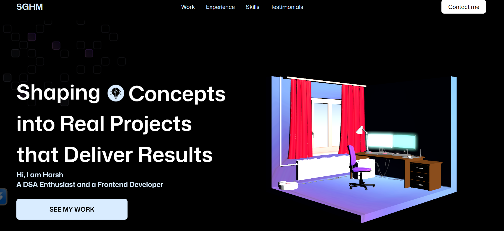
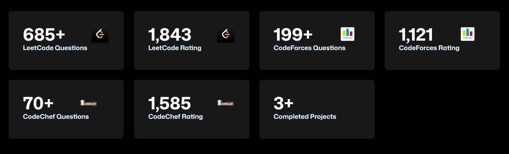
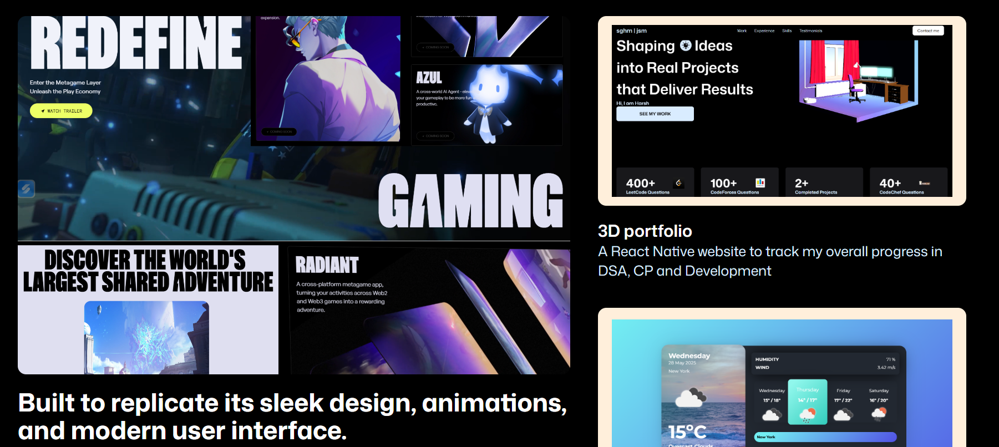
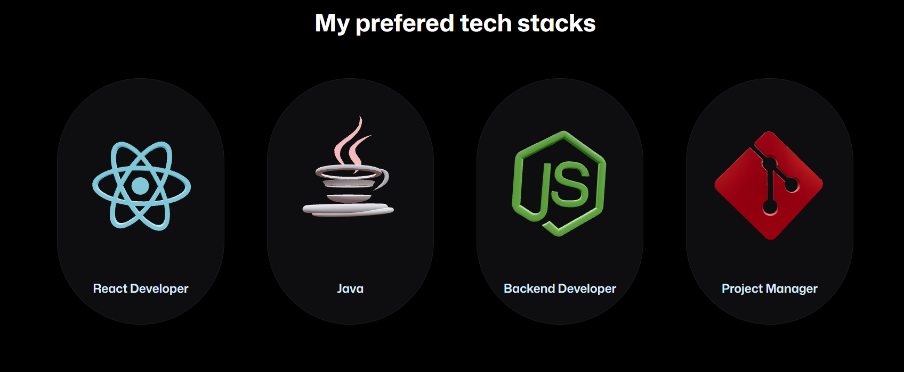

# 🌐 3D Portfolio

A modern 3D portfolio website built with React, Three.js, and Vite.

An interactive **3D Developer Portfolio** that showcases my journey as a **DSA Enthusiast** and **Frontend Developer**, combining **3D visuals**, **live stats tracking**, and **smooth animations** — all built using **React**, **Tailwind CSS**, **GSAP**, and **GLTF**.

# React + Vite

This template provides a minimal setup to get React working in Vite with HMR and some ESLint rules.

Currently, two official plugins are available:

- [@vitejs/plugin-react](https://github.com/vitejs/vite-plugin-react/blob/main/packages/plugin-react) uses [Babel](https://babeljs.io/) for Fast Refresh
- [@vitejs/plugin-react-swc](https://github.com/vitejs/vite-plugin-react/blob/main/packages/plugin-react-swc) uses [SWC](https://swc.rs/) for Fast Refresh


## 🚀 Overview

This project is a 3D personal portfolio that highlights my technical progress, skills, and projects in an immersive and dynamic environment.  
It features live coding stats, interactive 3D models, and sleek UI animations inspired by next-gen web designs.

## Project Structure

```
3Dportfolio/
├── public/                  
│   ├── images/              
│   │   ├── logos/           
│   │   └── textures/        
│   └── models/              
├── src/                     
│   ├── components/          
│   │   ├── HeroModels/      
│   │   └── Models/          
│   │       └── TechLogos/   
│   ├── constants/          
│   ├── sections/            
│   ├── services/            
│   ├── App.jsx              
│   ├── index.css           
│   └── main.jsx             
├── index.html              
├── package.json             
└── vite.config.js           
```

## Features

- Interactive 3D elements using Three.js
- Responsive design
- Modern UI with smooth animations
- 🧭 **Hero Section** – Eye-catching 3D intro scene with a dynamic tagline.
- 📈 **Animated Counters (with Live APIs)** – Fetches real-time coding stats using the **Codeforces API** and displays progress across platforms:
    - **LeetCode:** 685+ questions solved | Rating: 1843
    - **Codeforces:** 199+ questions solved | Rating: 1121 *(via live API)*
    - **CodeChef:** 70+ questions solved | Rating: 1585
    - **Projects Completed:** 3+
- 💼 **Projects Showcase** – Displays personal projects with screenshots, stack info, and quick access links.
- 💡 **Tech Stack Section** – Animated GSAP-based icons of all technologies I use.
- 🎨 **Smooth Animations** – Implemented using **GSAP** for fluid motion between sections.
- 🧩 **3D Models** – Created with **GLTF** and rendered in React for a realistic 3D environment.
- 📬 **Contact Section** – Allows visitors to easily reach out for collaborations or discussions.

---

## 🛠️ Tech Stack

| Category | Technologies Used |
|-----------|-------------------|
| **Frontend** | React.js, JavaScript |
| **Styling** | Tailwind CSS |
| **3D Rendering** | GLTF / Three.js |
| **Animations** | GSAP |
| **API Integration** | Codeforces API |
| **Version Control** | Git & GitHub |

---

## ⚙️ Live API Integration

The **Codeforces API** is used to fetch my latest contest rating and problem-solving stats.  
The data updates dynamically in the counter section every time the website is loaded.

Example API Endpoint used:

```
https://codeforces.com/api/user.info?handles=<your-handle>
```

---

## 📊 My Current Stats

| Platform | Questions Solved | Max Rating |
|-----------|------------------|------------|
| **LeetCode** | 685+ | 1843       |
| **Codeforces** | 199+ | 1150        |
| **CodeChef** | 70+ | 1585       |
| **Projects Completed** | 3+ | —          |

---

## 📸 Preview


### 🖥️ Hero Section


### 📈 Stats Counters


### 💼 Projects Showcase


### 🛠️ Tech Stacks

---


## Getting Started

1. Clone the repository
2. Install dependencies: `npm install`
3. Start the development server: `npm run dev`
4. Open your browser and navigate to `http://localhost:5173`

## Technologies Used

- React
- Three.js
- Vite
- JavaScript/JSX
- CSS

## 👨‍💻 Author

**Harsh Mehar**  
💻 DSA Enthusiast | Frontend Developer

📧 **Email:** harshmehar4955@gmail.com

💼 **LinkedIn:** [https://linkedin.com/in/harsh-mehar](https://www.linkedin.com/in/harsh-mehar-010853288)  
🐙 **GitHub:** [https://github.com/harshmehar](https://github.com/HarshMehar50)

---

## 🧠 Inspiration

This portfolio was inspired by next-gen developer portfolios combining **3D visuals**, **motion design**, and **live data**.  
The goal was to create a space that reflects both my **problem-solving** mindset and **frontend creativity** — turning concepts into real, impactful projects.

